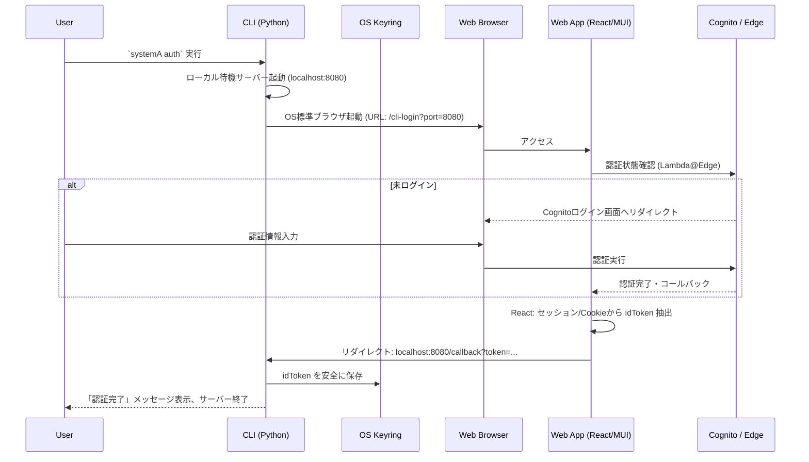
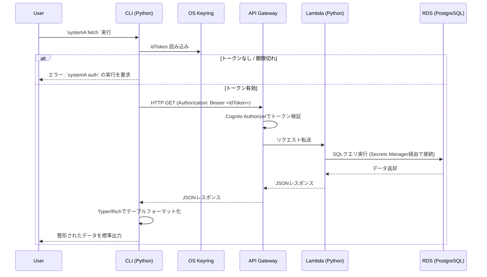

# CLIツール（`systemA`）仕様およびアーキテクチャ設計書

## 1. 概要
本ドキュメントは、システムに対して安全に認証を行い、ターミナル上から直接データ（API）を取得するためのCLIツール（`systemA`）の仕様、アーキテクチャ、および技術選定の意思決定理由（ADR）をまとめたものです。
既存のセキュリティモデル（Cognito + Lambda@Edge）を維持しつつ、セキュアで開発者体験（DX）の高いツールを提供します。

---

## 2. 想定AWSアーキテクチャと全体構成

本CLIツールは、以下のAWSベストプラクティスに準拠したアーキテクチャと連携して動作します。

---

## 3. コマンド仕様と処理フロー

### 3.1 認証コマンド：`systemA auth`

システムへのログインを実行し、取得した `idToken` をOSのセキュアな領域に保存します。CognitoのコールバックURL変更を避けるため、「Webアプリハブによるローカルループバック方式」を採用します。

### 3.2 データ取得コマンド：`systemA fetch`

保存されたトークンを用いてAPI Gateway経由でバックエンドのLambdaを呼び出し、RDS(PostgreSQL)のデータを取得・表示します。

---

## 4. 技術選定とアーキテクチャの意思決定（ADR）

本設計において、セキュリティ・保守性・UXを最大化するために以下の技術スタックとアーキテクチャを選定しました。

### 4.1 CLIフロントエンド: Python + Typer + Rich

* **選定理由**:
バックエンド（Lambda）の標準言語であるPythonを採用することで、チーム内の認知負荷を下げ、ロジック（型の概念やバリデーションルール等）の共有を容易にします。
`Typer`は型ヒントを活用した直感的なコマンドライン引数解析を提供し、`Rich`はコンソール上に色付きの美しいテーブルやスピナー等を描画できます。これにより、GitHub CLIライクな優れたDX（開発者体験）を実現します。

### 4.2 セキュリティ強化（トークン保存）: OSネイティブキーストア (`keyring`)

* **選定理由**:
認証トークン（`idToken`）をプレーンテキストのJSON等でローカルファイルに保存すると、マルウェア等による漏洩リスクが高まります。Pythonの `keyring` ライブラリを利用し、macOSのKeychainやWindowsの資格情報マネージャー等、OSが提供する暗号化ストレージに保存することで、最小権限の原則に基づく高度なセキュリティを担保します。

### 4.3 コードの秘匿化と配布: PyInstaller

* **選定理由**:
社内・外のユーザーにCLIツールを配布する際、内部のAPIエンドポイントやロジックが露呈することを防ぎます。PyInstallerを用いて単一のバイナリ実行ファイル（`.exe` 等）にコンパイルすることで、ソースコードを難読化し、さらにユーザーのPC環境にPythonがインストールされていなくても動作するポータビリティを提供します。

### 4.4 Webアプリハブ方式: React + TypeScript + Material UI (MUI)

* **選定理由**:
Cognitoへ `localhost` のコールバックURLを追加できない運用上の制約をエレガントに回避するための設計です。既存のS3 + CloudFront + Lambda@Edgeのホスティング基盤を活用し、`/cli-login` 用のReactコンポーネントを新設します。
UI実装には既存システムと一貫した **Material UI (MUI)** を採用し、ユーザーに違和感のないローディング画面やエラー表示を提供します。
また、フロントエンドコードは **Biome** による厳格なLint/Formatを徹底し、型安全（TypeScript）で保守性の高いクリーンアーキテクチャを維持します。

### 4.5 バックエンド連携: API Gateway + Lambda(Python) + RDS

* **選定理由**:
API Gatewayの Cognito User Pools Authorizer を用いることで、CLI側からのリクエストをAWSマネージドな仕組みで確実かつスケーラブルに検証します。
Lambda（Python）はVPC内に配置され、Secrets Managerから動的に取得したパスワードを用いてRDS（PostgreSQL）へセキュアに接続します。DBへの直接アクセスを遮断し、常にAPI層を経由させることで、データへのアクセス監査とビジネスロジックの集中管理を実現します。

## 5. インストール必要なパッケージとライセンス情報の一覧

本CLIツールにおいて依存する主要なサードパーティ製パッケージと、それぞれのオープンソースライセンス（商用利用・再頒布の可否等）の一覧を以下に定義します。

### 5.1 CLIツール側 (Python)
| パッケージ名 | バージョン (推奨) | 用途・選定理由 | ライセンス |
| :--- | :--- | :--- | :--- |
| **`typer`** | `^0.9.0` | CLIのコマンド定義および対話型インターフェース構築 | MIT License |
| **`rich`** | `^13.0.0` | ターミナル上の色付きテーブル描画、スピナー、美しい出力 | MIT License |
| **`keyring`** | `^24.0.0` | OSネイティブキーストア（Keychain / 資格情報マネージャー）へのセキュアなトークン保存 | MIT License |
| **`requests`** | `^2.31.0` | API GatewayへのHTTPリクエスト送信 | Apache 2.0 |
| **`pyinstaller`** | `^6.0.0` | ソースコードの秘匿化および単一バイナリ実行ファイルへのビルド (開発時依存) | GPL v2 (※バイナリ成果物の商用利用制限なし) |
